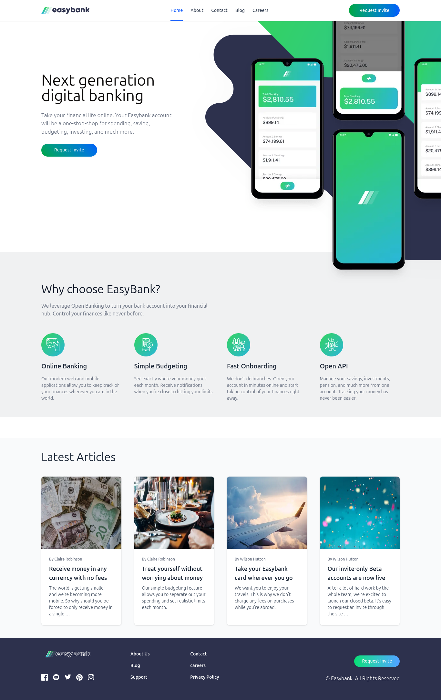

# Frontend Mentor - Easybank landing page solution

This is a solution to the [Easybank landing page challenge on Frontend Mentor](https://www.frontendmentor.io/challenges/easybank-landing-page-WaUhkoDN). Frontend Mentor challenges help you improve your coding skills by building realistic projects.

## Table of contents

- [Overview](#overview)
  - [The challenge](#the-challenge)
  - [Screenshot](#screenshot)
  - [Links](#links)
- [My process](#my-process)
  - [Built with](#built-with)
  - [What I learned](#what-i-learned)
  - [Continued development](#continued-development)
  - [Useful resources](#useful-resources)
- [Author](#author)
- [Acknowledgments](#acknowledgments)

## Overview

### The challenge

Users should be able to:

- View the optimal layout for the site depending on their device's screen size
- See hover states for all interactive elements on the page

### Screenshot



### Links

- Solution URL: [https://github.com/AskTiba/DigitalBank-LP]
- Live Site URL: [https://digital-bank-lp.vercel.app/]

## My process

### Built with

- Semantic HTML5 markup
- Flexbox & CSS Grid
- Mobile-first workflow
- [Next.js](https://nextjs.org/) – React framework
- [Tailwind CSS](https://tailwindcss.com/) – Utility-first CSS framework
- [shadcn/ui](https://ui.shadcn.com/) – Accessible components built with Tailwind
- [Firebase Studio](https://firebase.google.com/) – as am code editor
- [Git](https://git-scm.com/doc) – version control
- [Vercel](https://vercel.com/) – for deployment

### What I learned

This project helped me:

- Deepen my understanding of responsive design using Tailwind utility classes.
- Master layout design using `flex`, `grid`, and spacing utilities in a mobile-first approach.
- Improve my component structuring and organization with Next.js.
- Implement design system components with `shadcn/ui`.
- Practice deploying a Next.js project with Vercel and linking it to a custom domain.
- Use Git effectively for version control through the Git CLI and GitHub.

#### Sample code snippet I’m proud of

```tsx
// components/FeatureCard.tsx
import React from "react";
import Image, { StaticImageData } from "next/image";

interface FeatureCardProps {
  icon: StaticImageData;
  title: string;
  description: string;
}

const FeatureCard: React.FC<FeatureCardProps> = ({
  icon,
  title,
  description,
}) => {
  return (
    <article className="flex flex-col sm:items-start items-center sm:text-left text-center gap-4 px-4 sm:px-0">
      <Image src={icon} alt={title} width={72} height={72} />
      <h3 className="text-xl font-semibold text-gray-800">{title}</h3>
      <p className="text-sm text-gray-500 max-w-xs">{description}</p>
    </article>
  );
};

export default FeatureCard;
```

This reponsive compenent was used to render a card.

### Continued development

In future projects, I want to:

- Explore advanced animations and transitions using Framer Motion.
- Improve performance and SEO techniques in Next.js apps.
- Deepen my understanding of accessibility best practices in Tailwind and React.
- Build more complex UI layouts and refine my use of design systems like shadcn/ui.

### Useful resources

* [Tailwind CSS Documentation](https://tailwindcss.com/docs) – My go-to for styling and layout references.
* [shadcn/ui Docs](https://ui.shadcn.com/docs) – Helped me structure and theme my UI components.
* [Firebase Docs](https://firebase.google.com/docs) – Used as a code editor.
* [Vercel Docs](https://vercel.com/docs) – For continuous deployment and managing environments.
* [FreeCodeCamp Articles](https://www.freecodecamp.org/news/) – Great explanations on Next.js, responsive design, and modern CSS tips.
* [YouTube Tutorials](https://www.youtube.com) – Channels like Frontend Masters, Web Dev Simplified, and Codevolution were really helpful.
* [Git Documentation](https://git-scm.com/doc) – For mastering commits, branches, and remote repositories.

## Author

* Website – [your-portfolio.com](https://your-portfolio.com)
* Frontend Mentor – (https://www.frontendmentor.io/profile/AskTiba)
* Twitter – (https://x.com/AskTiba)

## Acknowledgments

A huge thanks to:

* The creators of the tutorials I watched on YouTube.
* The authors of articles on FreeCodeCamp for their detailed breakdowns of frontend concepts.
* The Tailwind, Next.js, and shadcn/ui communities for the amazing tooling and documentation.

